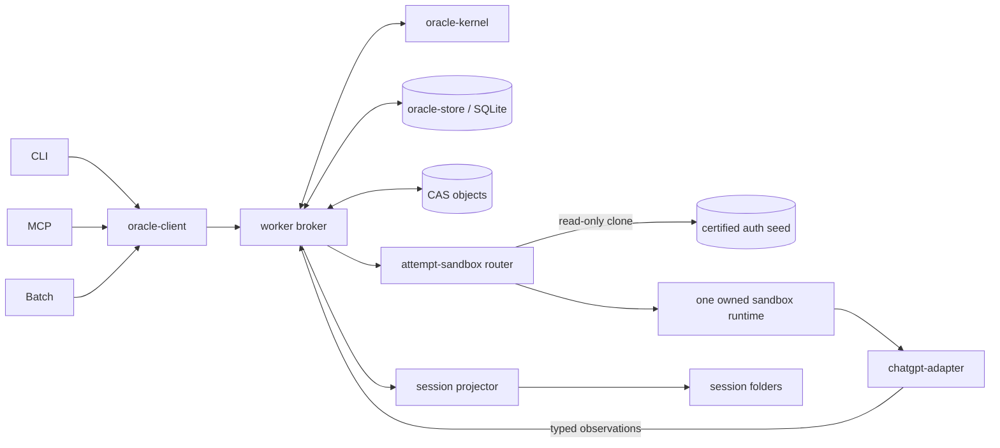

# Oracle v2 master plan

Status: accepted architecture; T0 owner-accepted; T1 source candidate complete,
real auth-seed gate blocked on one fresh login

Repository baseline: `fork/main@efae6f94714df2f63a2c3afbed817def42421f23`
(2026-09-04; PR #9 merge)

Integrated source line: `fork/main` (R0-R9, the legacy post-merge safety work
through PR #8, and the T0 authority freeze in PR #9 are historical source
truth)

## Goal and authority

Oracle v2 replaces invocation-owned browser execution with one durable local
job system:

> one worker, one SQLite ledger, one content-addressed object store, one
> certified login-only auth seed, one disposable browser sandbox per turn
> attempt, one ChatGPT adapter boundary, and one sealed textual bundle path.

The current legacy direct-CDP engine remains executable and remains the shipped
default until G3, but its auto-submit lane is frozen for ordinary owner work.
Do not extend or broadly refactor `src/browser/**`; only a bounded data-loss or
duplicate-send emergency fix may enter that lane before G4. The fixed-profile
v2 runtime is also a superseded candidate: it remains source/history until the
disposable-sandbox replacement passes its own gates, but receives no further
shared-profile ownership machinery.

This plan is the authority for v2 scope and acceptance. Implementation details
may adapt to repository evidence, but any change to product scope, gate
ownership, retry authority, provider/model guarantees, or legacy retirement
must be recorded as a plan delta before implementation.

### 2026-09-25 bounded legacy compatibility delta

The owner authorized one availability repair after ChatGPT replaced the
shipped legacy route's model-picker trigger and power-slider attributes and
every ordinary consultation began failing unsent during model or Pro effort
selection. The repair may recognize the newly observed semantic Intelligence
trigger, simple picker view, and accessible effort status, with focused
regression coverage. It must not weaken model or effort proof or alter
Send/retry authority, browser ownership, recovery, or the G3/G4 programme. This
one bounded compatibility exception does not reopen the legacy lane for
ordinary feature or symptom work.

## Product boundary

The first canonical v2 lane is:

- a macOS GUI-session worker;
- ChatGPT web with GPT-5.6 Sol and Pro effort, verified independently;
- a text prompt or a text prompt plus one deterministic UTF-8 source bundle;
- exactly one external Send attempt per turn attempt;
- local CLI, MCP, and Batch clients;
- SQLite authority, CAS objects, and rebuildable session projections;
- recovery from client disconnect, worker crash, capture disconnect, and a
  committed conversation reopening;
- no automatic provider, model, account, runtime, or transport downgrade.

Deferred capabilities remain explicit legacy or secondary-engine features:
multiple independent attachments, inline/upload fallback, binary and media
review, ZIP ingestion, copy-profile, cookie sync, attach-running, arbitrary
remote Chrome, non-macOS browser workers, Deep Research, image generation,
Project Sources, Temporary Chat, automatic engine fallback, recursive Batch
DAGs, and a GUI/dashboard.

## Authority and dependency graph



Only the broker may append authority events and change durable job state.
Adapters return typed observations; browser processes, pages, targets, ports,
and PIDs are disposable execution resources and never durable job truth.

Workspace dependency direction:

```text
oracle-kernel
    ^
oracle-store      oracle-bundle      oracle-client
    ^                  ^                  ^
    +------------- oracle-worker --------+
                  ^             ^
          chatgpt-adapter  oracle-browser-runtime

root CLI / MCP / Batch -> oracle-client + oracle-bundle
```

`scripts/check-v2-boundaries.mjs` enforces the legacy-import and adapter
knowledge boundaries. Root CLI/MCP/Batch cutover enforcement becomes active in
R8; until then their legacy imports remain an explicit staged compatibility
path.

## Durable state contract

Jobs use explicit `(idempotencyScope, idempotencyKey)` uniqueness. Repeating a
key returns the existing job and never creates another Send. Similar content
may warn, but never authorizes automatic deduplication.

The durable states are:

```text
queued -> preparing -> ready-to-dispatch -> dispatch-reserved
       -> dispatch-at-risk -> committed -> capturing -> completed

pre-Send failures -> failed-unsent
committed capture failures -> recoverable(committed-capture)
verified unsent evidence -> recoverable(verified-unsent) -> failed-unsent
unknown effects after dispatch-at-risk -> ambiguous -> owner closure only
terminal owner closure -> canceled-unsent | abandoned
```

The reducer rejects every unlisted transition. Before the external action the
broker durably appends `dispatch-at-risk`; after that point the same attempt can
only prove commit, enter ambiguity, or prove unsent. It can never automatically
Send again.

Completion requires all of these bound to one turn attempt:

- preparation receipt with exact model/effort and, when required,
  composer-anchored bundle evidence;
- dispatch intent with prompt/bundle identity and pre-Send baseline;
- submission receipt with exact committed user turn and conversation identity;
- capture receipt with the assistant successor and completion evidence;
- answer object whose digest matches the receipt.

## Storage and protocol contract

`oracle-store` owns `node:sqlite`, migrations, transactional event+snapshot
updates, CAS references, projection rebuild, integrity checks, backups, and
retention. The worker is the sole writer. The local protocol is HTTP over an
owner-only Unix socket with object upload, job admission, status, sequenced
events, resume, abandon, worker status, and canary operations.

Session folders remain a stable readable projection. Adapter code never writes
them. Projection failure is recorded and retried without rolling back an
already committed external submission.

The scheduler uses one dispatch mutex. Capture concurrency may remain bounded
above one at the job layer, but browser ownership is never shared across jobs.
Preparation, verification, Send, and at-risk observation for one turn share one
exact dispatch sandbox/key/lifetime. A fresh committed-capture recovery or probe
uses its own purpose-specific sandbox. Every sandbox has one process, one
adapter, and at most one page.

## Browser and provider contract

G1 began by comparing three fresh dedicated-profile candidates: Playwright's
bundled Chromium, the supported branded Chrome channel, and the exact Oracle
Chrome for Testing executable launched as a Playwright persistent context. On
the accepted macOS host, both executable candidates were rejected by Google
OAuth and the branded stable channel was safety-blocked because its macOS
application identity could interfere with everyday Chrome.

Faye therefore selected one revised runtime mechanism on 2026-08-31: the exact
Oracle Chrome for Testing executable is launched and owned by the v2
worker/runtime host, binds CDP only to loopback, and is controlled by Playwright
through `connectOverCDP`. G1 proved that mechanism and authenticated state, but
its fixed job profile is now a superseded candidate rather than the final
ownership model. PID, port, page, target, process, and profile remain disposable
execution evidence rather than job truth or normal operator output. There is no
automatic runtime or transport fallback.

G1 completed on 2026-08-31 with all eight owner acceptance checks passing for
`managed-chrome-for-testing-direct-cdp:152.0.7977.42`. That evidence may seed
the replacement login boundary, but ordinary consultation execution must never
launch the seed directly or copy data back into it. Every turn attempt clones a
fresh owner-only sandbox from one unchanged seed generation and uses at most one
page. The private runtime certification remains installed-runtime evidence, not
a default-engine switch or a live consultation receipt; T1 must replace it with
certification bound to the auth-seed generation and two-clone isolation proof.

The auth seed is login/setup input only. A pre-Send failure destroys the whole
sandbox without clearing, adopting, or inspecting a draft for ownership. A
completed or ambiguous job persists ledger truth and then destroys its browser
workspace. `dispatch-at-risk` may observe commit only in its exact sandbox and
has zero Send authority. Multiple live recovery candidates or failed ambiguity
containment poison that attempt runtime permanently, so later page-open and
preserved-page operations reject. A committed-capture recovery may create a
fresh capture-only sandbox and navigate from the durable submission receipt.
Garbage collection consults job state, the sandbox owner marker, and exact process
identity only; composer DOM never grants cleanup or Send authority. Because a
persisted PID can be recycled between observation and signal delivery,
cross-process GC never signals it directly: it may request `Browser.close`
through the exact receipt-validated CDP connection, then retains the sandbox if
the process does not exit and no stable kernel process handle is available.

This trim changes browser resource ownership only. It does not import legacy
browser source, change provider/model/effort guarantees, authorize a Send,
switch the default engine, or collapse G3 and G4. The legacy engine stays frozen
and executable until the later cutover gates.

All ChatGPT selectors, locators, page evaluation, upload behavior, message
identity, completion detection, recovery, and UI fingerprinting live in
`packages/chatgpt-adapter`. A no-Send compatibility probe globally blocks new
dispatch when a mandatory capability is absent; it emits one provider incident
instead of one full DOM dump per queued job.

The canonical source input is either text-only or text plus one sealed textual
bundle. Bundle membership and bytes are deterministic. A bundle job cannot
reach dispatch readiness without composer-anchored exact artifact evidence,
and cannot complete without attachment evidence on the committed user turn.

## Programme sequence

| Slice    | Outcome                                                                                                  | Dependencies                                                | Required evidence                                                         | Status                     |
| -------- | -------------------------------------------------------------------------------------------------------- | ----------------------------------------------------------- | ------------------------------------------------------------------------- | -------------------------- |
| R0       | freeze boundary, public architecture authority, progress ledger, workspace skeleton, boundary checker    | baseline                                                    | unchanged legacy tests; boundary check                                    | verified                   |
| R1       | typed JobSpec/events/states/receipts, pure reducer, retry and owner policy, schema upcasting             | R0                                                          | illegal-transition and completion-invariant tests                         | verified                   |
| R2       | SQLite store, migrations, transactional append, explicit idempotency, CAS, projections, integrity/backup | R1                                                          | crash consistency, duplicate admission, projection rebuild                | verified                   |
| R3       | Unix-socket worker, singleton, scheduler, event stream, fake provider, client, restart recovery          | R1-R2                                                       | client/worker kill recovery; bounded 1,000 fake jobs                      | verified                   |
| R4       | provider fixture, Playwright adapter, capability probe, UI fingerprint, test faults                      | R3                                                          | 500 fixture jobs; all fault points; Send count at most one                | verified                   |
| R5 / G1  | certify worker-managed Chrome for Testing over direct CDP after owner login                              | R4                                                          | persistent login, cold restart, model/effort/upload/click stability       | verified                   |
| R6       | real ChatGPT no-Send adapter probe and sanitized fixture capture                                         | G1                                                          | compatibility receipt; no prompt submitted                                | verified                   |
| R7 / G2  | text, bundle, and committed-capture-recovery live canaries                                               | R6                                                          | exact model/effort/turn/bundle/conversation/capture receipts; one Send    | verified                   |
| R8       | CLI and MCP v2 engine/cutover candidate; legacy remains default                                          | G2                                                          | repeated reviews; client reconnect; MCP timeout retrieval                 | verified                   |
| R9       | Batch lane/synthesis jobs preserve sealing, barrier, blind lanes, owner closure                          | R8                                                          | restart/recoverable/accept-missing/synthesis Batch with no duplicate Send | verified                   |
| R10 / G3 | make v2 the default browser engine; move legacy operations to advanced surface                           | R8-R9                                                       | packed CLI, fixture/fault suite, stable-window evidence                   | owner-gated                |
| R11      | remote bridge proxies durable objects/jobs/events/artifacts                                              | R10                                                         | disconnect/idempotency/artifact transfer integration                      | planned; independent of G4 |
| R12 / G4 | retire legacy canonical execution; keep read-only session compatibility and rollback                     | T1-T3, R10/G3, supported-platform replacement or retirement | no canonical legacy imports; migration/read compatibility; rollback tag   | owner-gated                |

G1 (runtime/login), G2 (first real Send), G3 (default switch), and G4
(legacy removal) are separate decisions. Source commits, installed runtime,
live browser acceptance, default activation, and legacy deletion are likewise
separate facts.

The disposable-attempt trim is inserted before G3 without reopening the v2
durable constitution:

| Slice | Outcome                                                                                                                                 | Gate                                                                                                                                                                      | Status                                     |
| ----- | --------------------------------------------------------------------------------------------------------------------------------------- | ------------------------------------------------------------------------------------------------------------------------------------------------------------------------- | ------------------------------------------ |
| T0    | Freeze authority, correct source/dependency mapping, and publish the legacy deletion map                                                | owner accepts trim boundary and deletion map                                                                                                                              | verified                                   |
| T1    | Add login-only auth seed, atomic sandbox clone/cleanup, exact process receipts, and the two-clone no-Send proof                         | owner-authorized real no-Send gate passes with unchanged seed and zero residue                                                                                            | source-candidate; fresh-login gate blocked |
| T2    | Route each provider purpose through one attempt sandbox/page and isolate cleanup failures by job                                        | fixture/fault suite proves at most one Send and later jobs remain schedulable                                                                                             | planned                                    |
| T3    | Run bounded text, bundle, pre-Send failure, at-risk interruption, capture-only recovery, and sequential live acceptance                 | each exact live case is separately owner-authorized and receipts match account history                                                                                    | owner-gated                                |
| G3    | Make `broker` the default browser route on a supported, certified macOS GUI worker; retain legacy as explicit short-lived rollback only | separate owner approval after T1-T3 and stable-resource evidence                                                                                                          | owner-gated                                |
| G4    | Physically remove legacy browser execution/ownership while preserving read-only history                                                 | separate owner approval after every supported platform has replacement cutover or explicit support retirement, accepted G3 evidence, and rollback tag; R11 is independent | owner-gated                                |

T0-T3 supersede the fixed-profile route to G3. They do not weaken or replace
R1-R4 kernel/store/worker/adapter authority, R8 client admission, R9 Batch
ownership, or the independent G3/G4 gates. The complete current ownership and
deletion reference map lives in
[`oracle-v2-browser-ownership-map.md`](oracle-v2-browser-ownership-map.md).
G3 is platform-qualified: Windows and other deferred worker platforms retain
their existing engine default. R11 remote bridging is no longer a G4
prerequisite because it uses the durable client protocol and does not own the
local legacy execution stack.
Because the legacy implementation is shared repository code, G4 cannot follow
the macOS cutover alone: every still-supported platform that uses legacy by
default must first receive an accepted replacement-worker cutover, or platform
support must be retired through a separate explicit owner gate.

## Complete acceptance ledger

| ID  | Required outcome                                               | Owning slice | Verification                   | Status      |
| --- | -------------------------------------------------------------- | ------------ | ------------------------------ | ----------- |
| D01 | client exit does not stop an admitted job                      | R3           | worker integration             | verified    |
| D02 | duplicate idempotency key returns one job                      | R2-R3        | store/API integration          | verified    |
| D03 | each turn attempt sends at most once                           | R1-R4        | reducer + fixture send counter | verified    |
| D04 | hard exit after click cannot cause resend                      | R3-R4        | process fault injection        | verified    |
| D05 | committed job stays bound to its conversation                  | R1, R4, R7   | fixture and canary receipts    | verified    |
| D06 | wrong-conversation navigation is rejected                      | R4           | fixture scenario               | verified    |
| D07 | bundle completion requires committed-turn attachment evidence  | R1, R4, R7   | reducer, fixture, canary       | verified    |
| D08 | model and Pro effort have independent receipts                 | R1, R4, R7   | schema + fixture + canary      | verified    |
| D09 | incompatible provider UI blocks before Send globally           | R3-R4        | compatibility incident test    | verified    |
| D10 | worker owns browser runtime without normal PID/port operations | R5-R7        | runtime and canary evidence    | verified    |
| D11 | CLI, MCP, and Batch use only the client protocol               | R8-R9        | boundary check + integration   | verified    |
| D12 | Batch sealing, barrier, and owner authority remain intact      | R9           | Batch integration              | verified    |
| D13 | session projections rebuild from DB/CAS                        | R2           | deletion/rebuild test          | verified    |
| D14 | debug objects obey TTL/cap/pinning                             | R2-R3        | retention tests                | verified    |
| D15 | default output excludes forensic internals                     | R3, R8       | output tests                   | verified    |
| D16 | v2 page knowledge exists only in chatgpt-adapter               | R0, R4       | boundary check                 | verified    |
| D17 | real canary receipts pass                                      | R7           | owner-authorized live canaries | verified    |
| D18 | fixture fault suite passes                                     | R4           | fixture/fault suite            | verified    |
| D19 | worker/browser/page soak has no continuing growth              | R4, R7-R10   | fixture and live soak          | in-progress |
| D20 | canonical flow works with legacy engine disabled               | R12          | canonical E2E with legacy off  | owner-gated |

Full completion means every D01-D20 row is verified at its appropriate layer.
A green unit suite or finished tranche is not full v2 completion.

## Hard anti-spiral rules

- No new v2 capability in the legacy browser path.
- No v2 import from legacy browser code.
- No ChatGPT page knowledge outside the adapter package.
- No mixed-meaning evidence booleans; observations and receipts are typed.
- No adapter authority to write job state or session projections.
- No automatic Send after `dispatch-at-risk`.
- No auth seed launched for an ordinary job and no sandbox copyback to the seed.
- No durable draft, tab, target, page, PID, port, process, or sandbox state.
- No profile-wide draft lease, digest adoption, orphan reclaim, sentinel hold,
  or cross-sandbox lineage mechanism.
- No cleanup or garbage-collection authority derived from composer DOM.
- No ambiguous or job-local cleanup failure blocking unrelated jobs.
- No implicit provider/model/account/runtime/transport switch.
- No second canonical bundle or attachment path.
- No second runtime before the first passes its long-running gate.
- No unit-test claim of real ChatGPT compatibility without a live canary.
- No normal workflow that requires PID, port, target, heal, or reconcile work.
- No default output of forensic internals.
- UI-drift fixes include a sanitized fixture, adapter test, and bounded canary.
- A tranche may change one primary authority boundary; cross-boundary changes
  are split into independently verifiable commits.

## Security, retention, and rollback

The database, objects, auth seed, attempt sandboxes, and socket are owner-only.
v2 performs no cookie extraction or normal-profile copy, exposes no default TCP
listener, emits no telemetry, and excludes prompt/source bytes from default
debug logs and exports. The seed has an exclusive setup/clone lock, is never a
job profile, and is never modified by sandbox execution. Sanitized fixtures
remove account and conversation data.

Authority receipts, job specifications, prompt/bundle/answer objects, owner
decisions, and Batch references follow session retention. Debug artifacts have
a 14-day default TTL, a 512 MiB cap, and unresolved-job pins. Idle daily SQLite
snapshots retain seven copies; integrity failure blocks Send and never triggers
an automatic destructive restore.

Until G3, rollback is selecting the unchanged legacy engine. Before G4, a
named rollback tag and read-only legacy-session compatibility are mandatory.
Legacy code is removed only after the canonical flow passes with legacy
execution disabled.

## Scope and order deltas

2026-08-31 G1 mechanism delta: the three Playwright-owned persistent-context
candidates were replaced by one worker-owned exact Chrome for Testing process
controlled through loopback direct CDP and Playwright `connectOverCDP`.
Candidate evidence showed Google OAuth rejection for the isolated
persistent-context paths and a macOS application-identity risk for branded
stable Chrome. This delta changes process ownership only; it preserves the
accepted v2 product boundary, R0-R12 dependency order, four owner gates, and
D01-D20 acceptance set.

2026-09-04 disposable-attempt trim delta: repository evidence at
`fork/main@39ab7fb3` shows that v2 still launches a hard-coded shared
`browser-profile`, retains a singleton runtime/adapter, budgets three shared
pages, preserves recovery windows across jobs, and globally blocks the runner
on any escaping job error. The accepted correction reclassifies that fixed
profile as a login-only auth seed, creates one disposable sandbox/runtime/page
per turn attempt and purpose, keeps dispatch and at-risk observation in the
same exact sandbox, destroys terminal/unsent/ambiguous workspaces, and permits a
fresh sandbox only for committed-capture recovery or probe work.
Kernel, store, worker ledger authority, bundle, client admission, receipts,
model/effort requirements, and G3/G4 remain intact. T0 changes documentation
authority only; no runtime behavior, local profile, or account state changes.
This delta also platform-qualifies G3 to the supported, certified macOS GUI
worker and removes R11 remote bridging from the G4 prerequisite chain. Remote
bridging remains planned after G3, but it neither authorizes nor blocks local
legacy deletion. Repository-wide G4 deletion additionally waits until no
supported platform depends on legacy execution; an owner-gated platform support
retirement may satisfy that platform boundary, but deferral alone may not.
